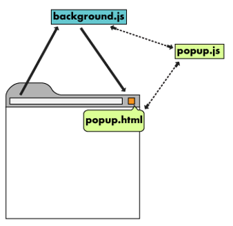
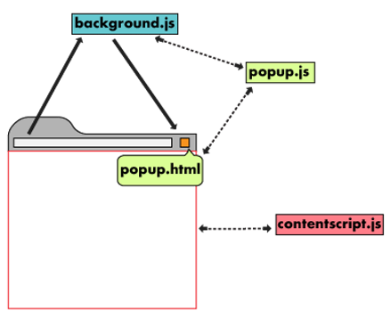
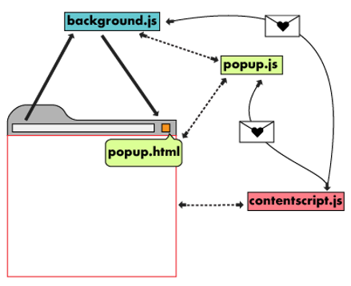

# Chrome Browser Extension - Video Playback Rate

This extension is primarily for _chrome_ and (so far) mostly based on the getting started tutorial from [Chrome Developers](https://developer.chrome.com/docs/extensions/mv3/getstarted/).

## Why does this repository exist?

Well ... quite simple:

- I wanted to check out how a browser extension is made (a bit more hands-on)
- Wanted to explore some new things (e.g. Typescript, Vite, Prettier, Linting, Workflows, GH-Hooks and so on...)
- Even though there are already extensions out there to increase the speed of a video, I wanted my own 🤪

I'm just getting started with this and build it in public in order to hold myself accountable and actually pull through. 🪅 Progress will be slow due to lots of other thing going on in my life.

## ToDo

- [X] Actually implement the core/base functionality (KISS)
- [X] How is an extension being deployed?
- [x] How is a third party library being added (npm)?
  - Kind of answered this myself, although not really using a third party library but WebComponents instead

What else could I do with it?
  - [x] Rework UI & use ShadowParts (Shadow DOM CSS)
  - [x] Add proper error-handling
  - [X] Make extension [themable](https://sap.github.io/ui5-webcomponents/playground/advanced/configuration/#theme) (include in options)
  - [X] Learn more about .d.ts files and how to declare & add them into the project
  - [x] Make UI respect your latest change within the tab (if you selected 2 and reopen the extension it should also reflect speedValue 2)
  - [x] Configure [prettier](https://prettier.io/docs/en/install.html)
  - [x] Add and configure ESLint
  - [x] Rethink the folder structure
  - [x] Configure [Vite](https://vitejs.dev/) for building the project
    - TS => JS => bundle/build/merge JS + Public folder => Dist
  - [?] Make extension cross-browser compatible
  - [?] Refactoring & Creation of Types 

## Architectural _Overview_ of an Extension

The full and official introduction (from Chrome) can be found [here](https://developer.chrome.com/docs/extensions/mv3/architecture-overview/).

_Note:_ With Manifest V3 the "background page" is now using a [Service Worker](https://developer.chrome.com/docs/extensions/mv3/service_workers/).

### High-Level Overview

### Content scripts

More details on content scripts can be found [here](https://developer.chrome.com/docs/extensions/mv3/content_scripts/).

Communication between the content script and the parent extension is done either by using the [storage API](https://developer.chrome.com/docs/extensions/reference/storage/) or using [messages](https://developer.chrome.com/docs/extensions/mv3/messaging/).

## Sources

- [MDN Web Docs](https://developer.mozilla.org/en-US/docs/Mozilla/Add-ons/WebExtensions/Build_a_cross_browser_extension)
- [Chrome Developers](https://developer.chrome.com/docs/extensions/mv3/getstarted/)
  - [What are Extensions?](https://developer.chrome.com/docs/extensions/mv3/overview/)
  - [Debugging Extensions](https://developer.chrome.com/docs/extensions/mv3/tut_debugging/)
  - [Extensions API Reference](https://developer.chrome.com/docs/extensions/reference/)
  - [Examples](https://github.com/GoogleChrome/chrome-extensions-samples)
- [FreeCodeCamp - Browser Extension](https://www.freecodecamp.org/news/write-your-own-browser-extensions/)
- [Chrome Extensions React+TS Starter](https://github.com/chibat/chrome-extension-typescript-starter)
- [UI5 Web Components - Slider Component](https://sap.github.io/ui5-webcomponents/playground/components/Slider/)
- [TS: Typescript Type Declaration Files](https://medium.com/jspoint/typescript-type-declaration-files-4b29077c43)
- [TS: Namespaces](https://medium.com/jspoint/typescript-namespaces-f43cd002c08c)
- [TS: Udemy Course](https://www.udemy.com/course/understanding-typescript)
- [Background Script M3](https://youtu.be/29dmxQ9QQ4o?t=416)
- [Github Release Action](https://github.com/ncipollo/release-action)
  - [GH Marketplace](https://github.com/marketplace/actions/create-release)
  - [alternative1](https://github.com/softprops/action-gh-release)
  - [alternative2](https://github.com/marketplace/actions/automatic-releases)

<a href="https://www.flaticon.com/premium-icon/fast-forward_5148595?term=fast%20forward&related_id=5148595">Icons by Flaticon</a>

